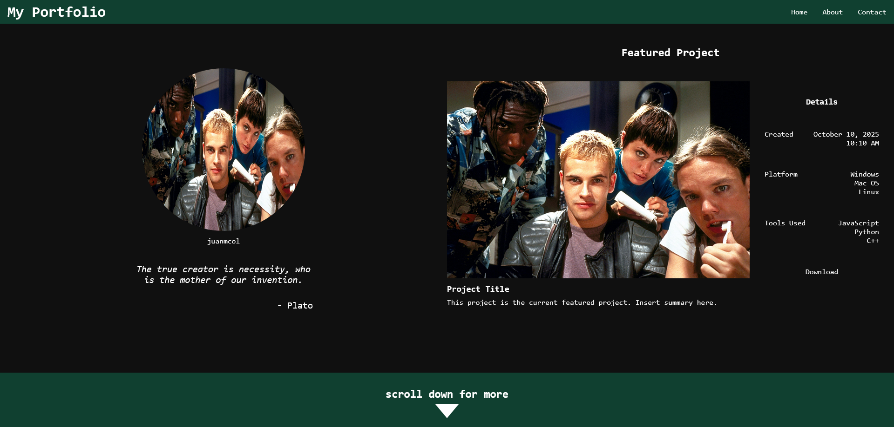

# Personal Portfolio

## Project Details
4th Commit!  

Added some JS to change the quote randomly. Currently only 2 quotes in my array. Changes the quote and the author for every 10-second invertvals. Used keyframes in CSS to make the arrow icon move. Below are some preview videos for these changes.

Image used is from Hackers (1995).

## Current Preview
### Screenshot

### Quote Change
<video width="1280" height="720" controls>
    <source src="assets/videos/portfolio-preview-quote-change.mp4" type="video/mp4">
</video>

### Scroll for More Change
<video width="1280" height="720" controls>
    <source src="assets/videos/portfolio-preview-scroll-for-more.mp4" type="video/mp4">
</video>