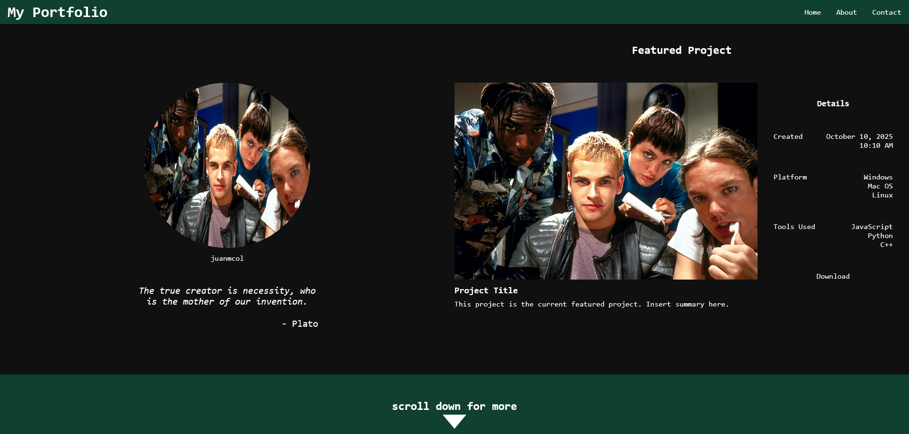

# Personal Portfolio

## Project Details
### 5th Commit! 

Changed a lot of flex elements to grid for easier placement and modifications, instead of using pure flex for everything.

### Previous Commit

Added some JS to change the quote randomly. Currently only 2 quotes in my array. Changes the quote and the author for every 10-second invertvals. Used keyframes in CSS to make the arrow icon move. Below are some preview videos for these changes.

Image used is from Hackers (1995).

## Current Preview
### Preview01 (more in assets)
