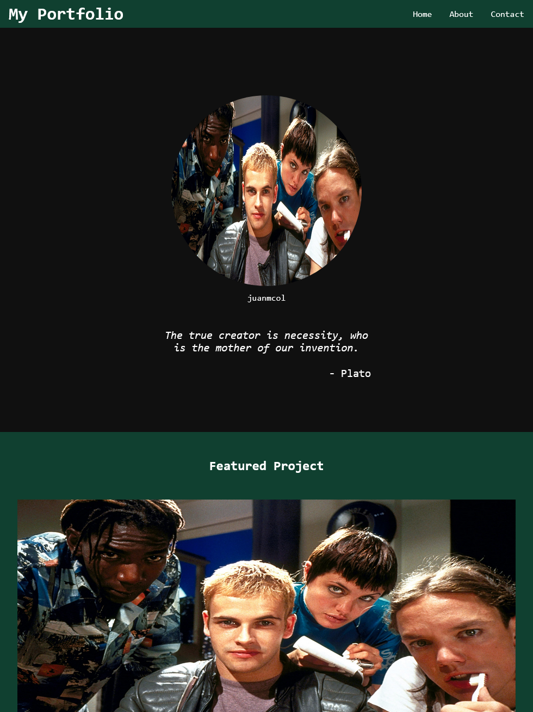

# Personal Portfolio

## Project Details
### 6th Commit! 

Added a responsive design and a click to expand feature for the table. Also made it so that if one resizes the window manually (e.g. on a desktop), then the table goes back to its original placement.

Still some details that could be improved. Especially, on mobile. The font size may be too small right now. I'd have to see it on my phone or something to test it out.

### Previous Commit

Changed a lot of flex elements to grid for easier placement and modifications, instead of using pure flex for everything.

Image used is from Hackers (1995).

## Current Preview
### Preview01 (more in assets)

### respdesign01 (more in assets)
